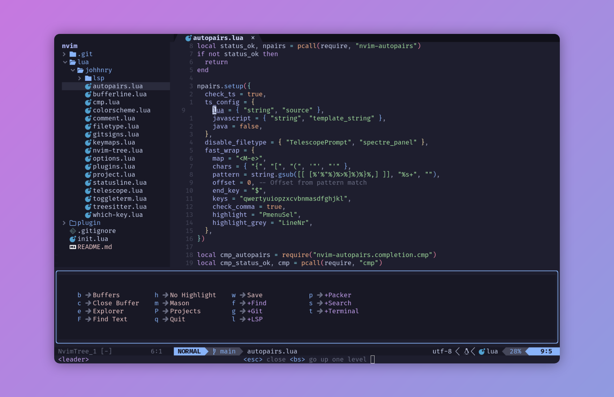

# johhnry's Neovim config



## Requirements

- NodeJS (npm)

- OCaml (opam) (You need to run `opam init`)

=> In Neovim run `:checkhealth` to see which dependencies you need

## Installation

Clone the configuration into your Neovim config folder:

```bash
git clone https://codeberg.org/johhnry/nvim-config.git ~/.config/nvim
```

## References

- `chris@machine` wonderful YouTube video serie: [Neovim from Scratch](https://www.youtube.com/playlist?list=PLhoH5vyxr6Qq41NFL4GvhFp-WLd5xzIzZ) (heavily inspired)
